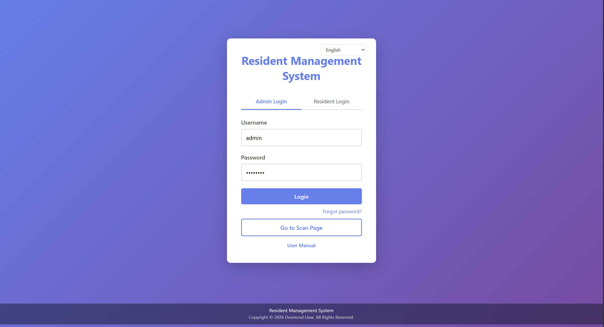
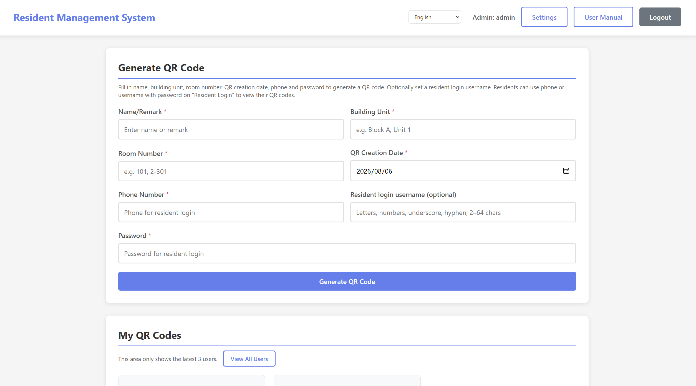
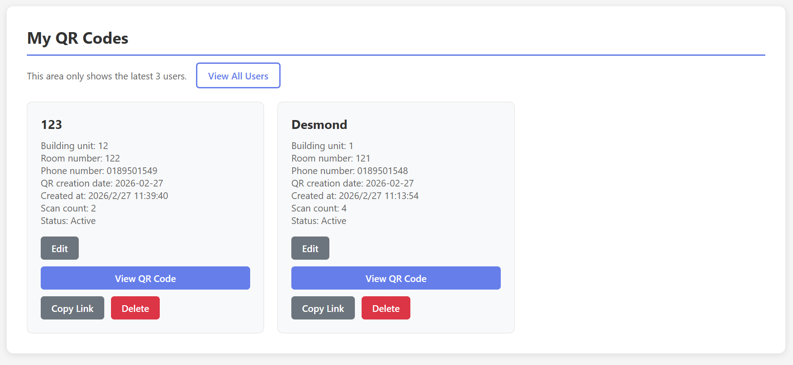
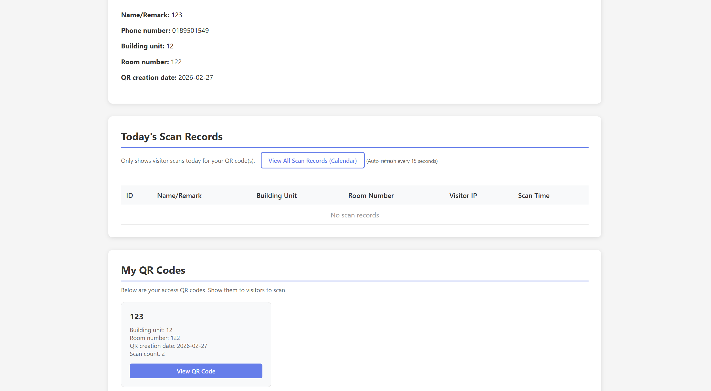

# 🏠 Resident Management System

A PHP + MySQL resident / visitor access system for apartment-style housing. Admins create unit QR codes, visitors scan them (camera or link), and residents can log in to view their own QR and scan history. UI supports **中文 / English / Bahasa Melayu**.

---

## ✨ Features

### 🔐 Dual login (Admin & Resident)
Admins sign in with username/password. Residents sign in with **phone or username** plus the password set when their QR was created. Includes admin account settings and email-based forgot-password (SMTP via PHPMailer).

### 📱 Resident QR generation
Admins create QR codes with name, building unit, room number, create date, phone, optional username, and password. Each code gets a unique scan token and shareable link.

### 📷 Visitor scan (camera or link)
Visitors open a scan link from the QR, or use the scan page camera (jsQR) for continuous scanning without login. Each successful scan is stored with visitor IP, user agent, unit info, and timestamp.

### 👤 Resident center
Residents see their profile, today’s scan records, their QR codes, and a calendar view of all their scan history.

### 📋 Admin monitoring
Admin dashboard shows recent QR cards, today’s scans, full user list (search/edit/delete), scan-records calendar, and a user-activity log monitor (admin / resident / visitor actions).

### 📖 Built-in user manual & i18n
In-app `manual.html` plus language switcher (zh / en / ms) across main pages.

---

## 🏗️ Tech Stack

| Category | Technology |
|---|---|
| 🖥️ Frontend | HTML5, CSS3, JavaScript |
| 🔙 Backend | PHP |
| 🗄️ Database | MySQL (required) |
| 📧 Email | PHPMailer (SMTP, optional for password reset) |
| 📷 QR | QRCode.js + jsQR (camera decode) |
| 🏠 Local Server | XAMPP (Apache + MySQL) |
| ☁️ Hosting | Shared hosting friendly (e.g. iFastNet) |

---

## 📁 Project Structure

```
resident_management_system/
├── index.html
├── admin.html
├── admin_users.html
├── admin_records_calendar.html
├── admin_activity.html
├── resident.html
├── resident_records_calendar.html
├── scan.php
├── manual.html
├── setup.php
├── config.php
├── config.local.sample.php
├── database.sql
├── database_upgrade.sql
├── api/
│   ├── login.php
│   ├── create_qr.php
│   ├── scan.php
│   ├── get_records.php
│   └── ...
├── assets/
│   ├── css/
│   │   └── style.css
│   ├── js/
│   │   ├── login.js
│   │   ├── admin.js
│   │   ├── resident.js
│   │   ├── scan.js
│   │   └── i18n.js
│   └── screenshots/
├── inc/
│   └── email_send.php
├── vendor/
└── README.md
```

---

## ⬇️ Download & Run on Localhost

1. Download this project from GitHub:  
   **[Code → Download ZIP](https://github.com/dljk0927prog/resident_management_system)**  
   or clone:
   ```bash
   git clone https://github.com/dljk0927prog/resident_management_system.git
   ```
2. Extract the ZIP (if downloaded), then rename the folder to `resident_management_system`.
3. Put the folder into XAMPP:
   ```
   C:\xampp\htdocs\resident_management_system\
   ```
4. Open **XAMPP Control Panel** and start **Apache** + **MySQL**.
5. In phpMyAdmin, create a database (e.g. `visitor_management_system`), select it, then import `database.sql`.  
   On shared hosting (iFastNet): create the DB in cPanel first, select it in phpMyAdmin, then import (skip `CREATE DATABASE` if the host blocks it). Set `DB_*` and `BASE_URL` in `config.php`.
6. Open your browser and go to:
   ```
   http://localhost/resident_management_system/
   ```

That’s it — you can start using the system right away.

> **Optional SMTP** (admin forgot-password): copy `config.local.sample.php` → `config.local.php` and fill in SMTP settings. Do not commit real passwords to a public repo.

---

## 🚀 How to Use the System

### 1) Admin login & create a resident QR
1. Open the home page and use the **Admin** tab.
2. Default account: username `admin` / password `admin123` — **change this after first login**.
3. Fill name, building, room, date, phone, password (optional username) → **Generate QR**.
4. Copy the scan link or show the QR image to visitors.

### 2) Visitor scan
1. **Link method:** open the QR scan URL — the system records the visit and shows success.
2. **Camera method:** open `scan.php`, allow camera access, point at a resident QR. Keep the camera on for continuous scans; failed camera access can fall back to the admin-provided link.
3. Each scan stores unit details, visitor IP, and time for admin/resident review.

### 3) Resident login
1. On the home page, switch to **Resident** login.
2. Sign in with phone **or** username + password set at QR creation.
3. View profile, today’s scans, personal QR codes, and the full scan calendar.

### 4) Admin monitoring
- **User list** — search, edit resident fields/password, delete QR users.
- **Scan calendar** — browse all scan history by date.
- **Activity monitor** — filter logs by role, search, and calendar.

---

## 🖼️ Project Screenshots

Camera preview on the scan page is omitted here (privacy / device UI). Features and How to Use cover link + camera scanning in text.

| Login | Admin dashboard |
|---|---|
|  |  |

| User list | Resident center |
|---|---|
|  |  |

---

## 🎬 Demo Video

👉 **[Watch Demo Video](https://drive.google.com/file/d/1hbliD8HErFp-4yglu8zv7DwSVsZE3LrV/view?usp=sharing)**

---

## 📺 Demo / Links

| Resource | Link |
|---|---|
| 🎬 Demo Video | [Watch](https://drive.google.com/file/d/1hbliD8HErFp-4yglu8zv7DwSVsZE3LrV/view?usp=sharing) |
| 💻 Local (XAMPP) | `http://localhost/resident_management_system/` |
| 📦 GitHub Repository | [dljk0927prog/resident_management_system](https://github.com/dljk0927prog/resident_management_system) |

---

## ✅ Quick Test Plan

- [ ] Import `database.sql` and open `http://localhost/resident_management_system/`
- [ ] Admin login (`admin` / `admin123`), create a QR with phone + password
- [ ] Open the scan link — record appears under today’s scans
- [ ] Resident login with that phone/password — see QR and today’s records
- [ ] Check user list, scan calendar, and activity monitor
- [ ] (Optional) Configure SMTP and test forgot-password email code

---

## 📄 License / Copyright

Copyright © 2026 Desmond Liew. All Rights Reserved.

---

⭐ If this project helps you, please star the repository!  
✨ Feel free to explore, fork, and improve it.
